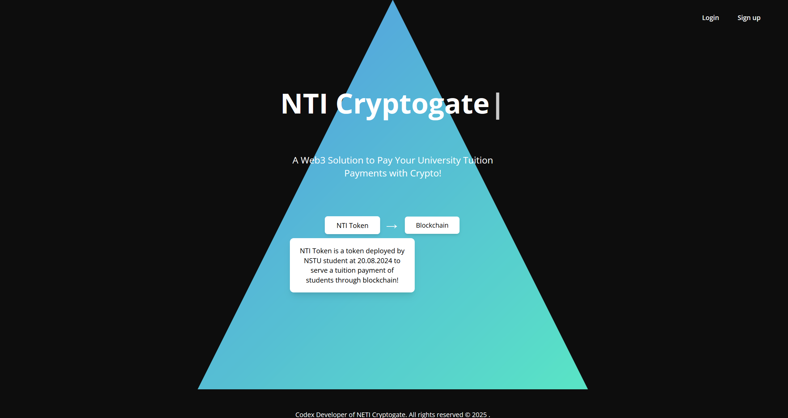

# NTI Cryptogate  
### Blockchain Tuition Payment Gateway for Foreign Students 

---

## 🌍 About the Project

**NTI Cryptogate** is a blockchain-powered platform built to help foreign students pay tuition fees using fast, low-cost, and sanction-resistant cryptocurrency payments. It is powered by the **NTI token**, deployed on both **Ethereum (Sepolia testnet)** and **Tron (Nile testnet)**.

The platform enables students to buy **NTI Token** with **USDT** across various networks , making education financing simpler and more accessible.

> ⚠️ **Note:** This platform is currently in **testnet mode** and has **not been officially confirmed or adopted** by any university. It remains a prototype built for research and development purposes only.

---

## 📷 Platform Preview

---

## 🚀 Key Features

- Fast, secure tuition payments using blockchain
- Support for USDT, NTI token, and future Digital Ruble
- Transparent transactions on Ethereum and Tron networks
- Designed for international student access

---

##  Token Information

- **Token Name**: NETI Token  
- **Symbol**: NTI  
- **Standard**: ERC-20 (Ethereum), TRC-20 (Tron)  
- **Decimals**: 18  
- **Networks**:  
  - Ethereum (Sepolia testnet)  
  - Tron (Nile testnet)  

📌 **Token Contract Address (Ethereum - Sepolia Testnet)**:  
[`0x5AE79bb95a7FE51ebD4240F5b06D11bf5c580FcB`](https://sepolia.etherscan.io/address/0x5AE79bb95a7FE51ebD4240F5b06D11bf5c580FcB)

📌 **Token Contract Address (Tron - Nile Testnet)**:  
[`TR7RGgCZyvwU6Kd4n6Xmyfv23Lx6XhVnvz`](https://nile.tronscan.org/#/token20/TR7RGgCZyvwU6Kd4n6Xmyfv23Lx6XhVnvz)

---

## 📄 White Paper

- [Read the full white paper (GitHub Markdown)](./WHITEPAPER.md)
- [Download full white paper (PDF)](./NTI_Cryptogate_Whitepaper.pdf)

---

## 🛡️ Legal Notice - All Rights Reserved

This project, white paper, and platform concept are the original intellectual property of **Codex(codex32byte)**, developed on **20.08.2024**.

All rights are reserved. No part of this content, idea, or implementation may be copied, reproduced, shared, forked, or reused in any form or by any means without explicit written permission from the author.

This public repository and document serve as official **proof of ownership and authorship**.

© 2024 Codex. All rights reserved.

---

## ✉️ Contact

- **Website**: [www.webwave3.io](http://www.webwave3.io)    
- **GitHub**: [https://github.com/NETICryptogate](https://github.com/codex32byte/NTI-Cryptogate-Whitepaper)  
